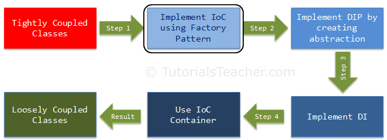
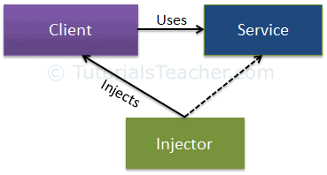

[Toc]

# C#程序员成长指南拓展

## 0、ASP.NET发展史(译)

### Part I

#### 0、摘要：

ASP.NET的第一个版本发布于20年前，这些年来，可以看到ASP.NET团队在过去的几年里对网络上发生的重大变化作出的建设性的改变。最初，ASP.NET是一个封闭的平台，试图隐藏和抽象Web。如今ASP.NET已经蜕变成一个开源和跨平台的平台——它完全领会了Web的本质。

这是ASP.NET历史的3篇系列文章的第一部分。涵盖从ASP.NET最初版本到最新的ASP.NET Core。

------

ASP.NET的第一个版本发布于20年前的2002年初，是.NET框架1.0版本的一部分。它最初的设计目的是提供一个比Classic ASP和ActiveX更好的Web平台，一个对现有Windows开发人员来说比较熟悉的Web平台。

当我们回顾它早期的设计，可能会惊讶地看到MVC、Web Services、JSON或JavaScript类型等概念是如何被考虑、讨论和/或引入ASP.NET的，这个时间比你记忆中的时间段更早。

我希望你会享受回忆过去，就像我写它时的心情一样。

#### 1、ASP.NET Web Forms时代(2002-2008)

微软在2002年1月向全世界发布了 ASP.NET 作为.NET 框架1.0版本的一部分。那时XML才是王道，未来是基于 XML Web 服务的。

当时 ASP.NET 的程序经理 Rob Howard [写道:](https://learn.microsoft.com/zh-cn/previous-versions/dotnet/articles/ms972384(v%3dmsdn.10))

"在过去的几个月中，业界已经意识到 Web 服务的前景。我有没有提到 XMLWebServices 代表了微软.NET 策略，是 ASP.NET 的一个核心特性吗？"

在 XML 时代，微软并不羞于在 XML 数据孤岛或 XMLHTTP ActiveX 控件等领域推进 IE。几乎没有人预料到其他浏览器会将后者作为标准的 XMLHttpRequest API 来实现，而且它将成为所谓的 Asynchronous JavaScript and XML(AJAX)的基础。当然，浏览器标准只是一个梦想，像 JavaScript 这样用浏览器检测技术来支持多浏览器的技术得到了[普遍推广](https://learn.microsoft.com/en-us/previous-versions/dotnet/articles/aa478988(v%3dmsdn.10))。

这些年也是DHTML(Dynamic HTML)迅速发展与推广的年代(在被标准化的 DOM、 JavaScript 和 CSS 淘汰之前)。用于创建桌面应用程序的企业开发人员正越来越多地转向 Web 应用程序，这些应用程序通常部署在企业内网上。

就在那时，微软发布了.NET 框架1.0以及 Visual Studio.NET，其中 ASP.NET Web Forms 是包的核心部分。这给了微软平台的开发人员一个比以前Classic ASP、 ActiveX 控件和 VB6 DLL 混合体更好的构建 Web 应用程序的方法。

#### 2、Web Forms的设计

千禧年之交，微软开辟了几条重要的战线:

- 它对Java的拥抱、扩展和消灭策略失败了([最终以诉讼告终](https://en.wikipedia.org/wiki/Microsoft_Java_Virtual_Machine))，现在它开始提供自己的可与Java竞争的托管语言替代方案
- 它需要一个更好的解决方案来构建和托管Windows中的Web应用程序，这样它才能在互联网泡沫的背景下继续竞争。
- 它的 RAD (Rapid Application Development快速应用开发)平台，老旧的 VisualBasic6，需要一个替代品。围绕开发人员的可视化工具和设计人员产生了许多议论，这是开发人员生产力的新银弹。

为了克服这些挑战，微软最终提出了自己的管理和解释平台.NET 框架，以及 C # 和 VB.NET 语言(现在简称为 Visual Basic)。这个框架的1.0版本提供了用于桌面和 Web 开发的特定工具，命名为 Win Forms 和 ASP.NET Web Forms。正如我们将看到的那样，他们的桌面和 Web 框架名称的相似性并非巧合！

Win Forms 被设计成用于开发 Windows 桌面应用程序的 VB6的继承者，为 Visual Studio 中的表单设计器提供了 VB6开发人员所熟悉的 RAD 体验。.NET Web Forms 将为开发 Web 应用程序提供非常类似的体验，在 Visual Studio 中有一个类似的表单设计器，并且编程模型将真正与他们现有的桌面开发人员产生共鸣。它的名字也暗示了这个新框架是Classic ASP 脚本框架的继承者。


​														  VisualStudio2003中的 Web 窗体设计器

这在当时是不可思议的，并且使得习惯于 Windows 应用程序的开发人员更加顺利地过渡到Web开发。或者至少在纸面上，因为这只能通过一些巧妙的抽象来实现，而这些抽象恰恰是构建 Web Forms 框架的基础，这些抽象将隐藏 Web 的真实性，并最终导致向 MVC 的转变！

Web Forms 是按照[PageController](https://www.martinfowler.com/eaaCatalog/pageController.html)模式设计的，PageController 模式是经典的 Web 表示模式之一。应用程序中的每个页都创建为 Web Forms并与.Aspx URL关联。页面通过 GET 请求加载并发送到浏览器。页中的控件(如按钮)将导致 POST 到相同的 URL，该 URL 由相同的 Web Forms页(或页控制器)处理。

每个 Web 表单都有两个不同的部分。最终定义页面 HTML 的 aspx 模板，以及实现 Page Controller 并提供必要逻辑的类。

这是 HelloWorld.aspx 模板:

```asp.net
<%@ Page language="c#" Codebehind="HelloWorld.aspx.cs" AutoEventWireup="false" Inherits="HelloWorldPage" %>
<HTML>
   <body>
      <form id="Form1" >
         Name:<asp:textbox id="name"  />
         <p />
         <asp:button id="MyButton" text="Click Here" OnClick="SubmitBtn_Click"  />
         <p />
         <span id="mySpan" ></span>
      </form>
   </body>
</HTML>
```

**注意:**虽然 aspx 文件中使用的视图引擎允许在*<% %>* 块中混合代码，但是这是不可接受的。.NET 社区刚刚摆脱了Classic ASP 及其意大利面条式的代码问题！

及其相应的代码隐藏 HelloWorld.aspx.cs 文件:

```c#
using System;
using System.Web.UI;
using System.Web.UI.WebControls;
using System.Web.UI.HtmlControls;

public class HelloWorldPage: System.Web.UI.Page
{
   protected System.Web.UI.WebControls.TextBox name;
   protected System.Web.UI.WebControls.Button MyButton;
   protected System.Web.UI.HtmlControls.HtmlGenericControl mySpan;

   public void SubmitBtn_Click(Object sender, EventArgs e) 
   {
      mySpan.InnerHtml = "Hello, " + name.Text + "."; 
   }
}
```

ASP.NET 框架提供了一组可以在每个页面上使用的控件。

asp:TextBox 和 asp: Button 标记是服务器控件的示例，它们不是标准的 HTML 标记。发送到客户端的最终 HTML 和 JavaScript 是在呈现页面时由框架生成的，并且取决于页面的属性和潜在的客户端。它们中的每一个都得到一个添加到代码隐藏类中的变量。

还有 HTML 服务器控件，它们与 HTML 元素直接相关，其目的是让代码隐藏类可以访问它们。在前面的示例中有一个 span mySpan，其对应的变量是 code-behind 类。

示例中的 asp: Button显示了另一个有趣的特征。服务器控件可以呈现必要的 HTML 和 JavaScript 来通过 PostBack 请求处理服务器上的事件，这只不过是对同一页面的 POST 请求，以及当前状态和被触发的控件和事件的名称。代码隐藏类中的一个方法可以与这些事件各自关联，这样在处理 PostBack 请求期间就可以在服务器上执行事件对应的方法。与 SubmitBtn _ Click 方法关联的 MyButton 的click 事件就是一个例子。

如你所见，每个页面都包含[一个 HTML Form表单](https://stackoverflow.com/questions/7544454/can-we-use-multiple-forms-in-a-web-page/7544462#7544462)，这将导致浏览器将其作为 POST 请求提交到相同的 URL。然后，服务器将实例化相同的页面控制器类，然后该类可以对Post请求作出反应。

对于习惯于使用桌面应用程序的开发人员来说，这个模型很熟悉，因为在桌面应用程序中，视图和页面控制器作为相同过程的一部分运行。然而，它向他们隐瞒了一个事实，即客户端和服务器是通过一个网络分离的，本质是无状态的。

ASP.NET通过组合拳保存状态:

- 它的状态管理，结合了不同的保存数据的方法。除了通常的Application和Session State，ASP.NET引入了View State。在将页面HTML发送到浏览器之前，服务器将页面控件的状态编码到Base64编码的字符串中，该字符串作为隐藏的表单字段包含在内。这个隐藏字段将被浏览器自动包含在POST请求中。
- 一个包含事件的页面生命周期，框架将在处理请求期间的不同时刻自动调用这些事件。这将允许从头初始化页面状态(如从数据库获取)或从发布的View State复原状态(如表单控件的属性)

下图显示了这一流程的运作情况:


​														ASP.NET 1.0中典型页面的流程

框架的设计假设大部分工作将由服务器完成，客户机主要呈现 HTML 文档并发出新的 GET/POST 请求。这是一个时代的标志，因为那时的客户端不像今天这样强大，浏览器也不像今天这样先进。

总的来说，ASP.NET 成功地实现了它的目标，提供了一个更接近桌面开发的模型和一个用于 Web 开发的 RAD 平台。然而，它在无状态网络上的有状态模型结合了对开发者隐藏Web的抽象，最终损害了框架的长远发展。

当然，自从 ASP.NET 发布以来的这些年我们有了当时人们没有的洞察力，批评或嘲笑20年前做的事情是很容易的。

但是，你会对 ASP.NET 中可能实现的功能感到惊讶！

通过阅读微软的模式和实践团队在2003年6月提供的模式，我发现它特别有趣，所有这些模式都是在 ASP.NET 中实现的:

- 他们提供了[MVC模式](https://learn.microsoft.com/zh-cn/previous-versions/msp-n-p/ff647462(v%3dpandp.10))的实现，比ASP.NET MVC的第一个版本早了好几年
- [Front Controller模式](https://learn.microsoft.com/en-us/previous-versions/msp-n-p/ff647590(v%3dpandp.10))的实现只是一个早期的尝试，它将发展成为ASP.NET MVC的路由组件
- [拦截过滤器模式](https://learn.microsoft.com/en-us/previous-versions/msp-n-p/ff649096(v%3dpandp.10))提供了与ASP.NET MVC中的过滤器类似的功能，甚至是ASP.NET Core中的中间件

的确，大多数开发人员从未遵循过这些模式。是的，指导主要集中在 RAD 方面，以及通过拖放设计器上的控件和在代码隐藏中编写事件处理程序来构建简单方便的应用程序。

但是，正如我们在这些模式中所看到的，开发人员只要稍微努力一下就可以构建干净的应用程序，这也是事实！

在我们继续之前，让我们回想一下在那个时候Web开发世界都发生了什么。

- ASP.NET的主要外部竞争对手是[Struts](https://en.wikipedia.org/wiki/Apache_Struts_1)和后来的[Spring](https://en.wikipedia.org/wiki/Spring_Framework)的Java框架。微软似乎认识到了这一点，他们早期的文档中有针对[熟悉Struts](https://learn.microsoft.com/en-us/previous-versions/dotnet/articles/aa478961(v%3dmsdn.10)#framework-patterns)和J2EE web技术的人的内容，正如[JSP ](https://en.wikipedia.org/wiki/JavaServer_Pages)(JavaServer页面)[迁移文章](https://learn.microsoft.com/en-us/previous-versions/dotnet/articles/aa478978(v%3dmsdn.10))所介绍的那样。
- 如前所述，一般的XML和基于XML的Web Services在当时是一个宏伟的设计。ASP.NET有一个通过HTTP提供的[Web Services](https://learn.microsoft.com/en-us/previous-versions/dotnet/articles/aa478995(v%3dmsdn.10))，而.NET框架附带了一个更通用的[.NET Remoting](https://learn.microsoft.com/en-us/previous-versions/dotnet/articles/ms973857(v%3dmsdn.10)), WCF的前身。不同平台(如.NET和Java)之间的Web服务交互是一件大事。
- 微软仍然拥有大量的VB6、ActiveX和Classic ASP程序员，他们必须转移到新的.NET平台上。正如你想象的那样，大量的工具以及文档被制作出来帮助过渡，就像这一[系列](https://learn.microsoft.com/en-us/previous-versions/dotnet/articles/aa302323(v%3dmsdn.10))收集在他们的官方文件中的文章。

公平地说，ASP.NET 的引入对微软来说是一个巨大的成功。它成为了主要的 Web 开发平台之一，并且在企业界得到了广泛的应用。

#### 3、完善ASP.NET Web Forms

尽管它很成功，但NET 框架还处于起步阶段，亟待成熟和完善。微软采用了每两年发布一次主要新框架版本的时间表，框架所有的部分包括 ASP.NET 都在同一时间进行升级。

2003年.NET Framework 1.1发布了，ASP.NET 收到了移动控件和其他一些小更新。2005年的.NET Framework 2.0框架向前迈进了一大步，走向成熟。

在那一刻.NET 获得了一些最有用和被广泛采用的特性。回首往事，想象自己在写作.NET 代码，而不使用泛型或可空值类型那种感觉真是太奇妙了。让我们简要回顾一下其中的一些特性:

- 泛型类型的引入使得采用提高可重用性和类型安全性的模式成为可能，比如泛型集合。在泛型之前，运行时强制转换通常会导致异常，并且由于值类型的装箱/拆箱而导致性能损失。微软自己会在框架的许多领域添加泛型方法和类型
- 还引入了可空类型，因此现在可以在使用Nullable<T>结构(泛型类型的另一个例子)时将null赋值给值类型
- C#获得了对静态类的支持。没错，C#在第一个版本中没有静态类!
- 现在C#和VB.NET中都可以使用部分类。这将极大地帮助Win Forms和Web Forms将Visual Studio生成的设计器代码与用户编写的实际代码分离开来。
- 一种用于管理事务的新模型，它能够透明地在现有环境事务中获取事务，并在本地事务管理器和Microsoft分布式事务协调器(Microsoft Distributed transaction Coordinator, MSDTC)之间进行提升。这极大地造福了许多使用ADO.NET用于数据访问和/或与现有的COM+组件集成的人。

在专门研究 ASP.NET 2.0时，2.0版本的重要性更加明显。除了受益于新的.NET 特性，比如泛型，ASP.NET经历了一次重大的变革，成为了一个更强大、更易于使用的框架。

这个版本中包含了一个新服务器控件的长列表。事实上，控件成为社区中扩展 ASP.NET 的首选方式之一，并开启了第三方控件供应商的行业。

但是包含更多的控件并不是框架更新的所有内容。


原文：[The History of ASP.NET| DotNetCurry](https://www.dotnetcurry.com/aspnet/1492/aspnet-history-part-1#)

## 1、依赖注入系统

### 1、发展史


Robert C. Martin在1996年为“C++Reporter”所写的专栏Engineering Notebook中首次提到依赖倒置原则：程序要依赖于抽象接口，不要依赖于具体实现。简单的说就是要求对抽象进行编程，不要对实现进行编程，这样就降低了客户与实现模块间的耦合。

1998年Stefano Mazzocchi试图为 Apache 不断增长的服务器端 Java 组件和工具设计一个“ Java Apache 服务器框架”(Avalon框架)时推广使用了“控制反转”这个术语实现了初代IOC容器注入方法：上下文依赖查找。

2002年左右Joe Walnes，Mike Cannon Brookes 在写《 Java 开源编程》这本书时使用第二代IOC注入方法："Setter Injection"即属性注入。

同一时间Spring 框架的领导者Rod Johnson写了一本书，《专家一对一的 J2EE 设计和开发》(2002年10月出版) ，也讨论了Setter 注入的概念，并且在2003年2月在 SourceForge 介绍后最终成为 Spring 框架的代码。

2003年《 Java 开源编程》的热心评论者之一Rachel Davies，建议用构造函数解析依赖关系更加优雅。PicoContainer容器负责人Paul Hammant和Aslak Hellesoy很喜欢这个想法后来在PicoContainer中实现了这个Idea。

### 2、原则->思想->具体实践

1. 依赖倒置原则DIP(Dependency Inversion Principle)

   DIP 建议高级模块不应该依赖于低级模块，而应该依赖于抽象

   抽象不应该依赖于细节，细节应该依赖于抽象

2. 控制反转IOC(Inversion of Control)

   IOC是一个设计原则，它建议在面向对象设计中反转不同类型的控件，以实现应用程序类之间的松散耦合。

3. 依赖注入DI(Dependency Injection）

   依赖注入(DI)是一种设计模式，它实现IOC原则来反转依赖对象的创建。

   它允许在类之外创建依赖对象，并通过不同的方式向类提供这些对象。使用 DI，我们将依赖对象的创建和绑定移到依赖它们的类之外。

4. IOC Container

   IOC容器是一个用于管理整个应用程序的自动依赖注入的框架。

控制反转(Inversion of Control)是依赖倒置原则的一种代码设计的思路。

控制反转关注三个部分：

1. 依赖注入DI
2. 依赖配置
3. 生命周期

依赖注入与DI 只关注IOC组件装配的一个方面。

IOC和 DIP 是在设计应用程序类时应该使用的高级设计原则。因为它们是原则，所以它们推荐某些最佳实践，但没有提供任何具体的实现细节。依赖注入(DI)是一个模式，IOC 容器是一个框架。


### 3、Sample例子

我们将通过一个示例学习IOC以及如何实现它。

#### 1、如何使用 Factory 模式实现IOC原则




在面向对象设计中，类应该以松散耦合的方式设计。松散耦合意味着一个类中的更改不应该强迫其他类进行更改，因此整个应用程序可以变得可维护和可扩展。让我们通过使用如下图所示的典型 n 层架构来理解这一点:


在典型的 n 层体系结构中，用户界面(UI)使用服务层来检索或保存数据。服务层使用 BusinessLogic 类对数据应用业务规则。BusinessLogic 类依赖于 DataAccess 类，后者检索数据或将数据保存到底层数据库。这是简单的 n 层架构设计。让我们关注 BusinessLogic 和 DataAccess 类来理解 IoC。

下面是Customer的 BusinessLogic 和 DataAccess 类的示例：

```c#
public class CustomerBusinessLogic
{
    DataAccess _dataAccess;

    public CustomerBusinessLogic()
    {
        _dataAccess = new DataAccess();
    }

    public string GetCustomerName(int id)
    {
        return _dataAccess.GetCustomerName(id);
    }
}

public class DataAccess
{
    public DataAccess()
    {
    }

    public string GetCustomerName(int id) {
        return "Dummy Customer Name"; // get it from DB in real app
    }
}
```

如上所示，CustomerBusinessLogic 类依赖于 DataAccess 类。它创建 DataAccess 类的对象以获取客户数据。

在上面的示例中，CustomerBusinessLogic 和 DataAccess 是紧密耦合的类，因为 CustomerBusinessLogic 类包含具体 DataAccess 类的引用。它还创建 DataAccess 类的对象并管理对象的生存期。

上述示例类中的问题:

1. CustomerBusinessLogic与DataAccess类紧密耦合,DataAccess类的修改将导致CustomerBusinessLogic类同步修改。例如我们增加、移除或重命名DataAccess类中任意方法相应的CustomerBusinessLogic类也需要做同样的修改。
2. 假设客户数据来自不同的数据库或 Web 服务，在将来，我们可能需要创建不同的类，这些都将导致CustomerBusinessLogic类的修改。
3. CustomerBusinessLogic类使用New关键字创建DataAccess对象。可能有多个类使用DataAccess类并创建它的对象。因此，如果更改类的名称，则需要在源代码中找到创建DataAccess对象的地方，并在整个代码中进行更改。这是用于创建同一个类的对象并维护它们的依赖关系的重复代码。
4. CustomerBusinessLogic类中创建具体对象DataAccess实例,它不能被被独立测试(TDD).DataAccess类不能替换为模拟类

为了解决上述所有问题，并得到一个松散耦合的设计，我们可以同时使用 IOC 和 DIP 原则。记住，IOC是一种原则，而不是一种模式。它只提供了高级设计指南，但没有给出实现细节。您可以按照自己的意愿自由地实现IOC原则。

以下模式(但不限于)实现 IOC 原则:


让我们使用 Factory 模式来实现上面示例中的 IoC，作为实现松散耦合类的第一步。

首先，创建一个简单的 Factory 类，该类返回 DataAccess 类的对象：

```c#
public class DataAccessFactory
{
    public static DataAccess GetDataAccessObj() 
    {
        return new DataAccess();
    }
}
```

现在，在CustomerBusinessLogic 类中使用DataAccessFactory获取 DataAccess类的对象：

```c#
public class CustomerBusinessLogic
{

    public CustomerBusinessLogic()
    {
    }

    public string GetCustomerName(int id)
    {
        DataAccess _dataAccess =  DataAccessFactory.GetDataAccessObj();

        return _dataAccess.GetCustomerName(id);
    }
}
```

CustomerBusinessLogic 类使用 DataAccessFactory.GetCustomerDataAccessObj ()方法获取 DataAccess 类的对象，而不是使用 new 关键字创建该对象。因此，我们将创建依赖类的对象从CustomerBusinessLogic 类反转到 DataAccessFactory 类。

这是IOC的一个简单实现，也是实现完全松散耦合设计的第一步。

#### 2、如何使用抽象实现依赖反转原则

在上面的例子中，我们实现了工厂模式来实现 IOC。但是，CustomerBusinessLogic 类仍然使用具体的 DataAccess 类。因此，即使我们将依赖对象的创建反转到工厂类，它仍然是紧密耦合的。

让我们对 CustomerBusinessLogic 和 DataAccess 类使用 DIP原则，使它们更加松散地耦合。

根据 DIP 的第一条规则，CustomerBusinessLogic 不应该依赖于具体的 DataAccess 类，而是两个类都应该依赖于抽象。意味着两个类都应该依赖于接口或抽象类。

接口(或抽象类)中应该包含什么内容？

CustomerBusinessLogic 使用 DataAccess 类的 GetCustomerName ()方法(在现实生活中，DataAccess 类中将有许多与Customer相关的方法)。因此，让我们在接口中声明 GetCustomerName (int id)方法：

```c#
public interface ICustomerDataAccess
{
    string GetCustomerName(int id);
}
```

在 CustomerDataAccess 类中实现 ICustomerDataAccess，如下所示：

```c#
public class CustomerDataAccess: ICustomerDataAccess
{
    public CustomerDataAccess()
    {
    }

    public string GetCustomerName(int id) {
        return "Dummy Customer Name";        
    }
}
```

我们需要更改工厂类返回 ICustomerDataAccess接口，而不是具体的 DataAccess 类：

```c#
public class DataAccessFactory
{
    public static ICustomerDataAccess GetCustomerDataAccessObj() 
    {
        return new CustomerDataAccess();
    }
}
```

更改CustomerBusinessLogic类使用ICustomerDataAccess接口，而不是具体的 DataAccess 类：

```c#
public class CustomerBusinessLogic
{
    ICustomerDataAccess _custDataAccess;

    public CustomerBusinessLogic()
    {
        _custDataAccess = DataAccessFactory.GetCustomerDataAccessObj();
    }

    public string GetCustomerName(int id)
    {
        return _custDataAccess.GetCustomerName(id);
    }
}
```

至此，我们在示例中实现了 DIP：

- 高级模块(CustomerBusinessLogic)和低级模块(CustomerDataAccess)依赖于抽象(ICustomerDataAccess)。
- 抽象(ICustomerDataAccess)不依赖于细节(CustomerDataAccess) ，但是细节依赖于抽象。

实现 DIP 的优点是 CustomerBusinessLogic 和 CustomerDataAccess 类是松散耦合的类，因为 CustomerBusinessLogic 不依赖于具体的 DataAccess 类，而是包含 ICustomerDataAccess 接口的引用。因此，现在我们可以很容易地使用另一个类，它使用不同的实现来实现 ICustomerDataAccess。

尽管如此，我们还没有实现完全松散耦合的类，因为 CustomerBusinessLogic 类包含一个工厂类来获取 ICustomerDataAccess 的引用。这就是依赖注入模式帮助我们的地方。

#### 3、实现依赖注入和策略模式

依赖注入模式包括三种类型的类：

1. **Client Class客户类:**客户端类(依赖类)是一个依赖于服务类的类
2. **Service Class服务类：**服务类(依赖项)是向客户端类提供服务的类
3. **Injector Class注射器类：**注入器类将服务类对象注入到客户端类中



注入器类创建服务类的对象，并将该对象注入到客户端对象。通过这种方式，DI 模式将创建服务类对象的责任从客户端类中分离出来。

注入器类通过三种方式广泛地注入依赖项: 通过构造函数、通过属性或通过方法。

- 构造函数注入: 在构造函数注入中，注入器通过客户端类构造函数提供服务(依赖关系)。
- 属性注入: 在属性注入(又名 Setter 注入)中，注入器通过客户端类的公共属性提供依赖项。
- 方法注入: 在这种类型的注入中，客户端类实现了一个接口，该接口声明了提供依赖项的方法，而注入器使用这个接口向客户端类提供依赖项。


##### 1、构造函数注入

```c#
public class CustomerBusinessLogic
{
    ICustomerDataAccess _dataAccess;

    public CustomerBusinessLogic(ICustomerDataAccess custDataAccess)
    {
        _dataAccess = custDataAccess;
    }

    public string ProcessCustomerData(int id)
    {
        return _dataAccess.GetCustomerName(id);
    }
}

public interface ICustomerDataAccess
{
    string GetCustomerName(int id);
}

public class CustomerDataAccess: ICustomerDataAccess
{
    public CustomerDataAccess()
    {
    }

    public string GetCustomerName(int id) 
    {
        //get the customer name from the db in real application        
        return "Dummy Customer Name"; 
    }
}
```

现在，调用类必须注入 ICustomerDataAccess 的对象。

```c#
public class CustomerService
{
    CustomerBusinessLogic _customerBL;

    public CustomerService()
    {
        _customerBL = new CustomerBusinessLogic(new CustomerDataAccess());
    }

    public string GetCustomerName(int id) {
        return _customerBL.ProcessCustomerData(id);
    }
}
```

CustomerService 类创建 CustomerDataAccess 对象并将其注入 CustomerBusinessLogic 类中。因此，CustomerBusinessLogic 类不需要使用 new 关键字或工厂类创建 CustomerDataAccess 对象。调用类(CustomerService)创建并将适当的 DataAccess 类设置为 CustomerBusinessLogic 类。通过这种方式，CustomerBusinessLogic 和 CustomerDataAccess 类变成了“更”松散耦合的类。

##### 2、属性注入

```c#
public class CustomerBusinessLogic
{
    public CustomerBusinessLogic()
    {
    }

    public string GetCustomerName(int id)
    {
        return DataAccess.GetCustomerName(id);
    }

    public ICustomerDataAccess DataAccess { get; set; }
}

public class CustomerService
{
    CustomerBusinessLogic _customerBL;

    public CustomerService()
    {
        _customerBL = new CustomerBusinessLogic();
        _customerBL.DataAccess = new CustomerDataAccess();
    }

    public string GetCustomerName(int id) {
        return _customerBL.GetCustomerName(id);
    }
}
```

CustomerBusinessLogic 类包含名为 DataAccess 的公共属性，在该属性中可以设置实现 ICustomerDataAccess 的类的实例。因此，CustomerService 类使用此公共属性创建和设置 CustomerDataAccess 类。

##### 3、方法注入

在方法注入中，依赖关系是通过方法来提供的。这个方法可以是类方法，也可以是接口方法。

下面的示例演示如何使用基于接口的方法进行方法注入：

```C#
interface IDataAccessDependency
{
    void SetDependency(ICustomerDataAccess customerDataAccess);
}

public class CustomerBusinessLogic : IDataAccessDependency
{
    ICustomerDataAccess _dataAccess;

    public CustomerBusinessLogic()
    {
    }

    public string GetCustomerName(int id)
    {
        return _dataAccess.GetCustomerName(id);
    }
        
    public void SetDependency(ICustomerDataAccess customerDataAccess)
    {
        _dataAccess = customerDataAccess;
    }
}

public class CustomerService
{
    CustomerBusinessLogic _customerBL;

    public CustomerService()
    {
        _customerBL = new CustomerBusinessLogic();
        ((IDataAccessDependency)_customerBL).SetDependency(new CustomerDataAccess());
    }

    public string GetCustomerName(int id) {
        return _customerBL.GetCustomerName(id);
    }
}
```

CustomerBusinessLogic 类实现 IDataAccessDependency 接口，该接口包括 SetDependency ()方法。因此，注入器类 CustomerService 现在将使用此方法向客户端类注入依赖类(CustomerDataAccess)。

我们已经使用了几个原则和模式来实现松散耦合类。在实际项目中，有许多依赖类，实现这些模式非常耗时。在这里，IOC容器(又名 DI 容器)可以帮助我们。

#### 4、IOC容器

IOC Container (又名 DI Container)是一个实现自动依赖注入的框架。它管理对象创建及其生命周期，并向类注入依赖项。

IOC 容器在运行时创建指定类的对象，并通过构造函数、属性或方法注入所有依赖对象，然后在适当的时候进行处理。这样做是为了不必手动创建和管理对象。

有许多可用于.NET 的开源或商业容器：

- Unity
- Castle Windsor
- Ninject
- Autofac
- SimpleInjector

ASP.NET Core微软实现了自己的依赖注入框架：

Microsoft.Extensions.DependencyInjection

Microsoft.Extensions.DependencyInjection.Abstractions

### 4、拓展：

**依赖也就是耦合,分为三种:**

1.零耦合(Nil Couping)关系:两个类没有依赖关系,(基本上就是这2个类没有互相调用的关系,甚至是没有关系)

2.具体耦合(Concrete Couping)关系:两个具体的类之间有依赖关系,如果一个类直接引用另一个具体类,就是这种关系.

3.抽象耦合(Abstract Couping)关系:这种关系发生在一个具体类和一个抽象类之间,这样就使必须发生关系的类之间保持最大的灵活性.

要做到依赖倒置原则,使用抽象方式耦合是关键(必须耦合的地方,那就用接口).由于一个抽象耦合总要涉及具体类从抽象类(或接口)继承,并且需要保证在任何引用到某类的地方都可以改换成其他子类,因此里氏代换是依赖倒置原则的基础,依赖倒置原则是OOD的核心。


**服务定位器模式：**

服务定位器模式是控制反转模式的一种实现方式，它通过一个称为服务定位器的外部组件来为需要依赖的组件提供依赖。

服务定位器有时是一个具体的接口，为特定服务提供强类型的请求，有时它又可能是一个泛型类型，可以提供任意类型的请求服务。

如：使用Factory模式实现IOC原则即是服务定位器模式的实现

### 5、参考

1. [Learn Inversion of Control Principle](https://www.tutorialsteacher.com/ioc)
2. [Inversion of Control History](http://picocontainer.com/inversion-of-control-history.html)

3. [控制反转](https://baike.baidu.com/item/控制反转/1158025)

## 2、模块化系统


## 3、本地化

## 4、事件总线

## 5、领域驱动设计

## 6、仓储模式

## 7、动态WebAPI实现


拓展：

API客户端：

- REST
- GraphQL


参考

1. [API/Auto API Controllers | Documentation Center | ABP.IO](https://docs.abp.io/en/abp/latest/API/Auto-API-Controllers)
2. 

## 8、认证与授权系统


## 9、常用软件架构

大型网站架构的演化发展引导着软件架构的发展。


最初的时候业务简单甚至都没有分层的概念，所有代码写在一个类中。

随着业务发展,系统开发者为了实现关注点分离，将软件分割成各个单元（称为“层”）。每一层都是一组模块，提供了一组高内聚的服务。

### 1、分层架构

大部分分层架构主要由四层组成：展现层、业务层、持久层和数据库层


- 每一层都有特定的角色和职责。分层架构的这种关注点分离，让构建高效的角色和职责非常简单。
- 分层架构模式是一个技术性的分区架构，而非一个领域性的分区架构。
- 请求不能隔层访问

这种方式应用于小型简单的应用程序或网站

### 2、MVC架构

#### 1、初代版本-Smalltalk

在1978年Trygve Reenskaug写了第一篇关于 MVC 的论文。当时他是著名的施乐帕洛阿尔托研究中心 Smalltalk 小组的访问科学家。最初他将其称为 Thing Model View Editor 模式，但是他很快将该模式的名称更改为 Model View Controller 模式。

Reenskaug 试图解决的问题是如何表示(建模)复杂的现实世界系统，如“主要桥梁，电站或海上石油生产平台的设计和建造。”人类有这些系统的心智模型，计算机有数字模型。如何在心智模型和数字模型之间架起一座桥梁？

MVC 模式早在第一个网络浏览器出现之前就已经发明了。

MVC 模式最初是作为 Smalltalk-80类库的一部分实现的。它最初被用作创建图形用户界面(GUI)的架构模式。

模型视图控制器模式的原始含义与今天的模式有很大的不同。在图形用户界面上下文中，模型视图控制器模式是这样解释的:

- 模型-由应用程序表示的特定数据。例如，气象站温度读数。
- VIEW-模型中数据的一种表示形式。同一个模型可能有多个关联的视图。例如，温度读数可以用标签和条形图来表示。这些视图通过观察者关系与特定的模型相关联。
- CONTROLLER-收集用户输入并修改模型。例如，控制器可能收集鼠标单击和击键，并更新模型。


**注意：**

1. 在此图中，视图是从模型间接更新的。当模型发生更改时，模型引发事件，视图响应该事件而发生更改。
2. 控制器并不直接与视图交互。相反，控制器修改模型，因为视图正在观察模型，所以视图得到更新。

根据 Martinfowler 的说法，这个最初版本的 MVC 模式的主要好处是分离呈现：确保任何操纵表示的代码只操纵表示，将所有领域和数据源逻辑推入程序的明确分离的区域

分离展示层是关注点分离(SoC)软件设计原则的一个特例。这是统一所有MVC模式理由的通用思路。**MVC模式提供了清晰的关注点分离。**

#### 2、二代版本-JSP

1998年JSP(JavaServer Pages)引入MVC架构，JSP版本MVC架构与原始版本有很大的不同，MVC 应用程序的组件是这样工作的:

- 模型-业务逻辑加上一个或多个数据源，例如关系数据库。
- VIEW-向用户显示模型信息的用户界面。
- 控制器-控制用户与应用程序的交互。

在这个新版本的 MVC 模型中，视图和模型之间不再有任何关系。视图和模型之间的所有通信都是通过控制器进行的。


#### 3、三代版本-ASP.NET MVC

2008年微软为.NET引入ASP.NET MVC版本,搭配ASP.NET的成熟框架组成一个强大的组合。


#### 4、对比分层架构与MVC架构

- 简单的Web应用程序：分层架构可以快速成型,开发简单
- 复杂的Web应用程序：MVC架构更易于测试、职责清晰分工明确、修改和维护简单

### 3、DDD领域驱动架构

领域驱动设计(Domain Driven Design)是 Eric Evans 在2003年首次引入的一种软件设计策略，旨在将复杂的领域(现实世界中的问题)简化为可扩展和可维护的软件解决方案。

"为了创建好的软件，你必须知道软件是关于什么的。除非你很好地理解银行是关于什么的，一个人必须了解银行的领域，否则不可能创建一个好的银行软件系统。"——Eric Evans


首先要有一个 DDD 的心态，将你的思维从数据驱动的方法中解放出来。为项目开发一种通用语言，有了通用语言之后就可以使用子域、Bounded Contexts有界上下文和Context Mapping上下文映射来进行战略设计。

#### 1、DDD相关概念


**通用语言Common Language**--围绕领域模型建立的一种语言，团队所有成员都使用这种语言把团队的所有活动与软件联系起来。

采用 DDD 方法构建软件时，团队应为问题空间开发一种通用语言。 即，要进行建模的实际概念、软件同义词以及可能存在以维持该概念的任何结构（例如数据库表）应使用相同的术语。 因此，通用语言中所述的概念应该形成领域模型的基础。


**战略设计Strategic Design**--一种针对系统整体的建模和设计决策。这样的决策影响整个项目，并且必须由团队来制定。

战略设计主要目标就是识别出领域、限界上下文，从大的方面划分出需要关注的重点而不关注具体的细节实现。

战略和战术设计是站在DDD的角度进行划分。战略设计侧重于高层次、宏观上去划分和集成限界上下文，而战术设计则关注更具体使用建模工具来细化上下文。

**领域Domain**--知识、影响或活动的范围

- 核心领域Core Domain--模型的独特部分，是用户的核心目标，它使得应用程序与众不同并且有价值

- 支撑子域Support SubDomain

- 通用子域Common Domain

  

**限界上下文Bounded Context-**-限界上下文是一个显式边界，领域模型便存在于边界之内。一个由显示边界限定的特定职责。领域模型便存在于这个边界之内。在边界内，每一个模型概念，包括它的属性和操作，都具有特殊的含义。

考虑产品所讲的通用语言，从中提取一些术语称之为概念对象，寻找对象之间的联系；或者从需求里提取一些动词，观察动词和对象之间的关系。我们将紧耦合的各自圈在一起，观察他们内在的联系，从而形成对应的界限上下文。形成之后，我们可以尝试用语言来描述下限界上下文的职责，看它是否清晰、准确、简洁和完整。简言之，限界上下文应该从需求出发，按领域划分。


**上下文映射图Context Map**--项目所涉及的限界上下文以及它们与模型之间的关系的一种表示

限界上下文之间的映射关系

- 合作关系（Partnership）：两个上下文紧密合作的关系，一荣俱荣，一损俱损。
- 共享内核（Shared Kernel）：两个上下文依赖部分共享的模型。
- 客户方-供应方开发（Customer-Supplier     Development）：上下文之间有组织的上下游依赖。
- 遵奉者（Conformist）：下游上下文只能盲目依赖上游上下文。
- 防腐层（Anticorruption Layer,ACL）：一个上下文通过一些适配和转换与另一个上下文交互。
- 开放主机服务（Open     Host Service）：定义一种协议来让其他上下文来对本上下文进行访问。
- 发布语言（Published     Language）：通常与OHS一起使用，用于定义开放主机的协议。
- 大泥球（Big     Ball of Mud）：混杂在一起的上下文关系，边界不清晰。
- 另谋他路（SeparateWay）：两个完全没有任何联系的上下文。


**战术建模--细化上下文**

**领域模型Domain Object**

组成领域模型的对象彼此交互，以表现系统行为。可分为以下几类：

- **Model Entity实体**--一种对象，它不是由属性来定义的，而是通过一连串的连续事件和标识定义的。
- **Value Object值对象**--一中描述了某种特征或属性但没有概念标识的对象
- **Domain Services领域服务**--一些重要的领域行为或操作，可以归类为领域服务。它既不是实体，也不是值对象的范畴。
- **Aggregates聚合**--聚合就是一组相关对象的集合，我们把聚合作为数据修改的单元。外部对象只能引用聚合中的一个成员，我们把它称为根。在聚合的边界之内应用一组一致的规则。
- **Domain Event领域事件**--表示系统中发生的与系统其他部分相关的事件


**Model Entity实体**：当一个对象由其标识（而不是属性）区分时，这种对象称为实体（Entity）。

- **充血模型：**所谓之“充血”，是一种设计的思路，它回归对象的本质，把原本属于领域对象的操作或方法回归到对象本身，与数据访问对象相比，领域对象更能体现业务的实际情况。
- **贫血模型:**缺少内在行为的领域对象

实体的两大特性：

1. 有唯一的标识，不受状态属性的影响。
2. 可变性特征，状态信息一直可以变化

**Value Object值对象**：当一个对象用于对事务进行描述而没有唯一标识时，它被称作值对象（Value Object）

值对象很重要，在习惯了使用数据库的数据建模后，很容易将所有对象看作实体。使用值对象，可以更好地做系统优化、精简设计。它具有不变性、相等性和可替换性。

实体有标识(Id)，值对象没有。如果两个实体的身份不同，即使这些实体的所有属性相同，它们也被视为不同的对象/实体。想象两个不同的人，他们有相同的名字、姓氏和年龄，但是是不同的人(他们的身份号码是不同的)。对于Address类(这是一个典型的值对象)，如果两个地址具有相同的国家、城市和街道编号等，则认为它们是相同的地址。

```c#
public class Address : ValueObject
{
    public Guid CityId { get; }

    public string Street { get; }

    public int Number { get; }

    public Address(Guid cityId,string street,int number)
    {
        CityId = cityId;
        Street = street;
        Number = number;
    }

    //Requires to implement this method to return properties.
    protected override IEnumerable<object> GetAtomicValues()
    {
        yield return Street;
        yield return CityId;
        yield return Number;
    }
}
```

**Domain Services领域服务**

当我们采用了微服务架构风格，一切领域逻辑的对外暴露均需要通过领域服务来进行。如原本由聚合根暴露的业务逻辑也需要依托于领域服务。

服务有三种类型: 领域服务、应用服务和基础设施服务

1. Domain Services

   封装的业务逻辑并不自然地适合于域对象，也不是典型的CRUD操作——这些操作属于存储库

2. Application Services

   由外部使用者用于与您的系统通信(考虑Web服务)。如果消费者需要访问CRUD操作，这里将公开它们。

3. Infrastructure Services

   用于抽象技术关注点(如MSMQ，电子邮件供应商等)。

**Aggregate(聚合）**：是一组相关对象的集合，作为一个整体被外界访问，聚合根（Aggregate Root）是这个聚合的根节点。

聚合由根实体，值对象和实体组成。

**如何创建好的聚合？**

- 边界内的内容具有一致性：在一个事务中只修改一个聚合实例。如果你发现边界内很难接受强一致，不管是出于性能或产品需求的考虑，应该考虑剥离出独立的聚合，采用最终一致的方式。

- 设计小聚合：大部分的聚合都可以只包含根实体，而无需包含其他实体。即使一定要包含，可以考虑将其创建为值对象。

- 通过唯一标识来引用其他聚合或实体：当存在对象之间的关联时，建议引用其唯一标识而非引用其整体对象。如果是外部上下文中的实体，引用其唯一标识或将需要的属性构造值对象。

- 如果聚合创建复杂，推荐使用工厂方法来屏蔽内部复杂的创建逻辑。

  

**领域模型Domain Object的生命周期**

领域模型Domain Object主要的挑战有以下两类：

- 在整个生命周期中维护完整性
- 防止模型陷入管理生命周期复杂性造成的困境当中

可以通过以下模式解决上面两个问题:

1. **聚合AGGREGATE**，它通过定义清晰的所属关系和边界，并避免混乱、错综复杂的对象关系网来实现模型的内聚。
2. 在Domain Object生命周期的开始阶段，使用**FACTORY(工厂)**来创建和重建复杂对象，并使用AGGREGATE来封装它们的内部结构。
3. 在生命周期的中间和末尾使用**REPOSITORY(存储库）**来提供查找和检索持久对象并封装庞大基础设施的手段。


#### 2、DDD常用模式


#### 3、DDD开发流程


#### 4、DDD Sample


#### 5、何时使用

DDD 非常适合业务（不仅仅是技术）非常复杂的大型应用程序。 

这种应用程序需要借助领域专家的知识。 领域模型本身应包含有某种意义的行为，应体现出业务规则和交互，而不仅仅是存储和检索数据存储中各种记录的当前状态。

**何时不该使用：**

DDD 需要在建模、体系结构和通信方面进行投资，这对于较小型的应用程序或本质只是 CRUD（创建/读取/更新/删除）的应用程序来说可能并不值得。

如果选择采用 DDD 处理应用程序，但发现领域中有一个没有任何行为的贫血模型，则可能需要重新考虑处理方法。可能是该应用程序不需要 DDD，也可能是你需要别人帮助你重构应用程序，将业务逻辑封装在领域模型中，而不是数据库或用户界面中。

可以使用混合方法，只对应用程序中的事务性区域或比较复杂的区域使用 DDD，而不对应用程序中比较简单的 CRUD 或只读部分使用 DDD。

例如，如果是为显示报表或将仪表板数据可视化而查询数据，则无需具有聚合约束。 使用单独的、更简单的读取模型处理这类要求是完全可以接受的。


Todo...

系统整理DDD相关知识。。

### 4、CQRS

1988年Bertrand Meyer 在其《面向对象软件构造》一书中首次使用CQS(Command Query Separation)术语。

其基本思想是，我们应该将对象的方法分为两个明显分开的类别：

- **查询Queries**：返回结果，不更改系统的可观察状态（无副作用）。
- **命令Commands**：更改系统的状态，但不返回值。

每种方法要么返回状态，要么更改状态，不会二者兼具。

CQRS命令和查询职责分离由 Greg Young 提出并由 Udi Dahan 等人大力推广。它基于 CQS 原则，在 CQRS 中，对象拆分为两个对象，一个对象包含命令，另一个包含查询。。

CQRS 的优势

- **系统行为之间的界限清晰**：它为构建与行为相关的应用程序提供了具体指导。
- **更接近业务逻辑**：代码和体系结构按其业务操作进行隔离，从而更容易专注于业务案例。
- **松耦合**逻辑是内聚的，并且相互关联性较低，因此更容易创建模块化的、可维护的应用程序。
- **减少认知负荷**由于垂直拆分，相关代码保持在一起。若要修改现有代码或创建新代码，无需了解整个体系结构和业务逻辑。专注于特定任务更容易。
- **更轻松地扩展、优化和架构更改**由于我们的代码保存在孤岛中，因此更容易仅微调一个管道，而其余部分保持不变。在业务关键型位置，可以更轻松地专注于精确优化。
- **可 预见性**由于隔离，您有操作行为的一般规则。您不会对查询更改应用程序状态感到惊讶;保持写入和读取逻辑之间的分离可以降低最终使用意大利面条式代码的机会。


Todo。。。

### 5、微服务架构

Todo...


### **7、拓展**知识

#### 1、**管道-过滤器架构**


将一个执行复杂处理的任务分解为一系列可重复使用的单个元素。 此模式允许单独部署和缩放执行处理的任务元素，从而可以提高性能、可扩展性和可重用性。

管道就像生产流水线上的传送带，过滤器就像每一道工序上的机器。管道负责数据的传递，原始数据通过管道传送给第一个过滤器，第一个过滤器处理完成之后，再通过管道把处理结果传送给下一个过滤器，重复这个过程直到处理结束，最终得到需要的结果数据。

ASP.NET Core一系列中间件组成一个管道。用户请求通过管道传递，每个中间件都有机会在将它们传递到下一个中间件之前对它们执行某些操作。传出响应也以相反的顺序通过管道传递。


```c#
public void Configure(IApplicationBuilder app)
{
    app.UseExceptionHandler("/Home/Error");
    app.UseStaticFiles();
    app.UseAuthentication();
    app.UseMvcWithDefaultRoute();
}
```

"Use*"每种方法都会向管道添加一个中间件。添加它们的顺序决定了请求遍历它们的顺序。因此，传入请求将首先遍历异常处理程序中间件，然后是静态文件中间件，然后是身份验证中间件，最终将由 MVC 中间件处理。


**延伸：**

中间件是组装到应用管道中以处理请求和响应的软件。每个组件：

- 选择是否将请求传递给管道中的下一个组件。
- 可以在管道中的下一个组件之前和之后执行工作。

所以过滤器是中间件的一种，是中间件中的一个类别。

#### 2、事件驱动架构Event Sourcing

事件驱动架构是围绕事件的发布、捕获、处理和存储(或持久性)构建的集成模型。具体来说，当一个应用程序或服务执行一个操作或经历另一个应用程序或服务可能想知道的更改时，它发布一个事件(该操作或更改的记录) ，另一个应用程序或服务可以使用该事件并依次处理该事件以执行一个或多个操作。

事件驱动架构使连接的应用程序和服务之间实现松散耦合ーー它们可以通过发布和使用事件彼此进行通信，除了事件格式之外，它们对彼此一无所知。与请求/响应体系结构(或集成模型)相比，这种模型具有显著的优势，在这种体系结构中，一个应用程序或服务必须从另一个特定的应用程序或服务请求特定的信息，而这些应用程序或服务正在期待特定的请求。


事件驱动架构被广泛认为是微服务实现的最佳实践。微服务可以使用 REST API 彼此通信。但是 REST，一种请求/响应集成模型，通过强制在微服务之间进行同步的、紧密耦合的集成，破坏了松散耦合微服务体系结构的许多好处。

**示例：**

一个电商应用程序工作流程如下：

Order Service 创建一个 Order，这个订单处于待定Pending状态，然后发布一个OrderCreated事件。

- Customer Service 接收到这个事件并尝试为这个 Order 扣除信用额度。然后发布一个Credit Reserved 事件或者CreditLimitExceeded(超出信用限额度)事件。
- Order Service接收到 Customer Service 发送的事件并将订单状态更改为已核准Open或已取消Cancel。

#### 3、DDD、CQRS And Event Sourcing


### 8、参考

1. [常用 Web 应用程序体系结构 | Microsoft Docs](https://docs.microsoft.com/zh-cn/dotnet/architecture/modern-web-apps-azure/common-web-application-architectures)
2. [ASP.NET MVC Version History](https://www.tutorialsteacher.com/mvc/asp.net-mvc-version-history)
3. [The Evolution of MVC](http://stephenwalther.com/archive/2008/08/24/the-evolution-of-mvc)
4. [管道和筛选器模式](https://docs.microsoft.com/zh-cn/azure/architecture/patterns/pipes-and-filters)
5. [ASP.NET Core Middleware](https://docs.microsoft.com/en-us/aspnet/core/fundamentals/middleware/?view=aspnetcore-6.0)
6. [ASP.NET Core Middleware With Examples](https://dotnettutorials.net/lesson/asp-net-core-middleware-components/)
7. [Understanding the ASP.NET Core Middleware pipeline](https://thomaslevesque.com/2018/03/27/understanding-the-asp-net-core-middleware-pipeline/)
8. [ASP.NET Core过滤器](https://docs.microsoft.com/en-us/aspnet/core/mvc/controllers/filters?view=aspnetcore-6.0)
9. [事件驱动的架构| Microsoft Docs](https://docs.microsoft.com/zh-cn/azure/architecture/guide/architecture-styles/event-driven)
10. [Event-Driven Architecture | IBM](https://www.ibm.com/cloud/learn/event-driven-architecture)
11. [Domain Driven Design | DevIQ](https://deviq.com/domain-driven-design/ddd-overview)
12. [CommandQuerySeparation (martinfowler.com)](https://martinfowler.com/bliki/CommandQuerySeparation.html)
13. [CQRS (martinfowler.com)](https://www.martinfowler.com/bliki/CQRS.html)
14. [CQRS Guide](https://www.eventstore.com/cqrs-pattern)
15. [在微服务中应用简化的 CQRS 和 DDD 模式 | Microsoft Docs](https://docs.microsoft.com/zh-cn/dotnet/architecture/microservices/microservice-ddd-cqrs-patterns/apply-simplified-microservice-cqrs-ddd-patterns)

